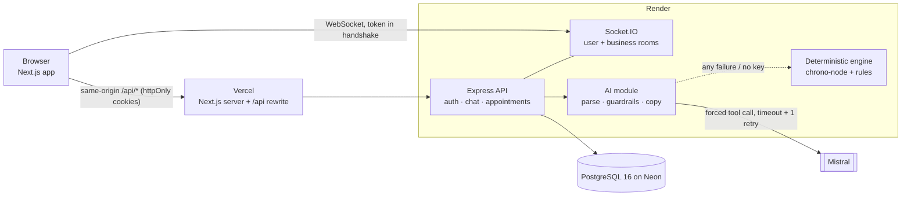
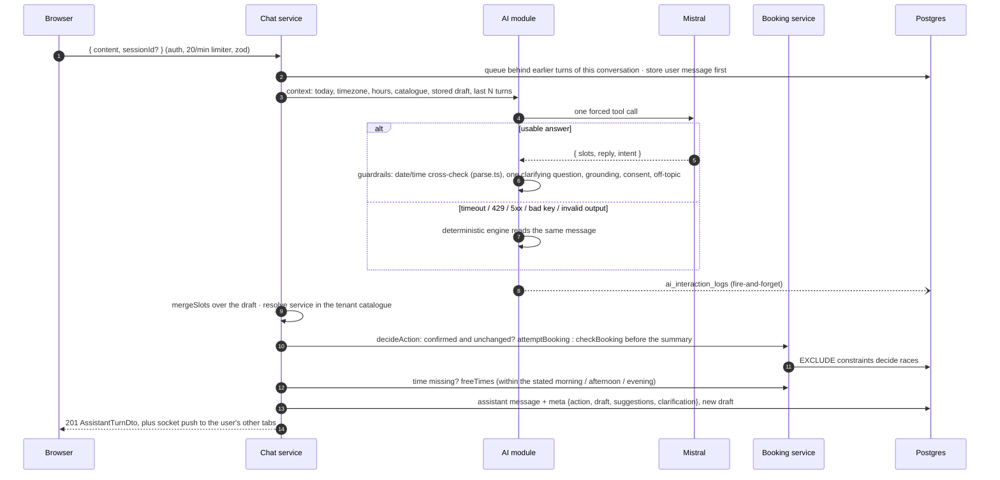

# Slotly — AI-assisted appointment booking

> **For reviewers**
>
> - **Live demo:** https://ai-appointment-booking-psi.vercel.app (sign in as `customer@bluewave.test` / `Password123!`; more logins [below](#live-demo)). First request after a pause can take ~30–60 s while the free API host wakes.
> - **Repo:** https://github.com/alisafdar35/ai-appointment-booking
> - **Architecture in one sentence:** a Next.js app proxies REST to an Express API, where Mistral only *extracts* booking details through one forced tool call, and plain code plus Postgres constraints *decide* what gets booked; Socket.IO adds live updates on top.
> - **The four sections the brief asks for:** [Architecture](#architecture) · [Run locally](#run-locally) · [Design decisions and tradeoffs](#design-decisions-and-tradeoffs) · [Assumptions and known limitations](#assumptions-and-known-limitations)
> - **Every requirement and edge case, with the test that proves it:** [docs/verification-matrix.md](docs/verification-matrix.md)

Slotly is a multi-tenant SaaS prototype. A customer types *"teeth whitening next Wednesday around 3"* and gets a booked appointment. The assistant asks for what is missing, one question at a time, offers real free times as chips, and shows a confirmation card. If the conversation stalls it offers a pre-filled form. If the language model is slow, rate-limited, misconfigured or simply wrong, booking still works. The LLM only **extracts**; ordinary code and Postgres constraints **decide**. That split is the core design decision, and the rest of the system is built around it.

**Stack:** Next.js 15 (React 19, TanStack Query, react-hook-form, Tailwind) · Express 4 + Socket.IO · PostgreSQL 16 · Mistral (`ministral-8b-latest`) with a deterministic fallback engine · zod schemas shared by both sides through `@appt/shared`.

## Live demo

| | |
|---|---|
| Web app | **https://ai-appointment-booking-psi.vercel.app** |
| API health | https://slotly-api-r5g6.onrender.com/health (DB status, active AI provider, uptime) |
| Repository | https://github.com/alisafdar35/ai-appointment-booking |

The API runs on Render's free plan, which sleeps after 15 minutes idle. The app shows "Waking up the server…" and keeps you signed in meanwhile.

| Email (password `Password123!`) | Role | Tenant |
|---|---|---|
| `customer@bluewave.test` | customer | Bluewave Dental (code `bluewave`, America/New_York, 09:00–17:00) |
| `staff@bluewave.test` | staff (sees every customer's bookings) | Bluewave Dental |
| `owner@bluewave.test` | owner (also `GET /api/ai/summary`) | Bluewave Dental |
| `owner@northside.test` | owner | Northside Clinic (Europe/London), a second tenant to show isolation |

You can also sign up and join Bluewave with the code `bluewave` (the default), or create a business of your own.

| Conversational booking | Booked, with live dashboard |
|---|---|
|  |  |
| **Form fallback (needs_form)** | **Appointments dashboard** |
|  |  |

More: [landing](docs/screenshots/landing.png) · [login](docs/screenshots/login.png) · [signup](docs/screenshots/signup.png) · [empty assistant](docs/screenshots/assistant-empty.png) · [mid-conversation](docs/screenshots/assistant-conversation.png) · [booking dialog](docs/screenshots/appointments-booking-dialog.png) · [cancel dialog](docs/screenshots/appointments-cancel-dialog.png) · [staff view](docs/screenshots/staff-dashboard.png) · [dark mode](docs/screenshots/dark-assistant.png) · [mobile assistant](docs/screenshots/mobile-assistant.png) · [mobile appointments](docs/screenshots/mobile-appointments.png)

## What the brief asked for, and where it is

| Brief | Implementation |
|---|---|
| Chatbot UI, real-time | `/assistant`: conversations, transcript, composer, draft rail, confirmation and booked cards. Each turn is REST; Socket.IO pushes typing, other-tab turns and appointment changes, and the app works fully without it |
| Auth (JWT) | 15-min HS256 access JWT + rotating 7-day opaque refresh token, both httpOnly cookies |
| Booking UI | Chat, an in-chat form, and a dialog with a live slot picker on `/appointments`, all through **one** booking service |
| REST API + middleware | 17 endpoints plus `/health` ([api.md](docs/api.md)); zod validation, pino logs with request ids, five rate-limit tiers, one error envelope |
| AI: understand, extract, remember, fall back, log | One forced Mistral tool call per turn (schema generated from the shared zod schema); the draft lives in Postgres; `needs_form` after 4 turns without progress; one `ai_interaction_logs` row per call ([ai-integration.md](docs/ai-integration.md)) |
| Database | [001_schema.sql](db/migrations/001_schema.sql), [002_indexes.sql](db/migrations/002_indexes.sql), [seed.sql](db/seed.sql), [verify.sql](db/verify.sql); `business_id` multi-tenancy with composite FKs ([database.md](docs/database.md)) |

## Architecture



- **REST goes through the web app's own origin**, so auth cookies are first-party (`SameSite=Lax`). Socket.IO connects to the API directly, because WebSocket upgrades do not survive the rewrite.
- **Routes handle HTTP, services hold the rules, repositories hold the SQL.** The AI module returns slots, a reply and an intent; it cannot write to the database or choose what the UI does. Details: [docs/architecture.md](docs/architecture.md).

**One chat turn** (`POST /api/chat/messages`):



## Run locally

Needs Node 22 (`.nvmrc`) and either Docker or your own PostgreSQL 15+ with `btree_gist`, `citext` and `pgcrypto` available.

```bash
git clone https://github.com/alisafdar35/ai-appointment-booking.git && cd ai-appointment-booking
cp .env.example .env    # set JWT_SECRET (32+ chars); MISTRAL_API_KEY is optional
npm run setup           # npm install, Postgres via docker compose on :5433, migrate, seed
npm run dev             # API on :4000, web on :3000
```

Open http://localhost:3000 and sign in as `customer@bluewave.test` / `Password123!`.

- **Without Docker:** create a database, point `DATABASE_URL` in `.env` at it, then `npm install && npm run db:migrate && npm run db:seed && npm run dev`. `psql "$DATABASE_URL" -f db/verify.sql` demonstrates the schema guarantees.
- **Other ports:** set `PORT` and `CORS_ORIGINS=http://localhost:<webport>` in `.env`, and `API_ORIGIN` / `NEXT_PUBLIC_SOCKET_URL` (`http://localhost:<apiport>`) in `apps/web/.env.local`; then `npm run dev:api` and `npm run dev -w @appt/web -- -p <webport>`.
- **Without a Mistral key** everything works; replies come from the deterministic engine, labelled "Guided mode".
- Every variable: [docs/configuration.md](docs/configuration.md). Reset local data: `npm run db:reset`.

**Tests:** `npm test` (API unit + integration against real Postgres, web unit), `npm run e2e` (Playwright on a freshly built, isolated stack on :3100/:4100), `npm run typecheck && npm run lint`. CI runs all of them. Counts and details: [docs/testing.md](docs/testing.md).

## Design decisions and tradeoffs

The ten that matter most are written up as ADRs in [docs/decisions.md](docs/decisions.md).

| Decision | Why | Cost |
|---|---|---|
| **The LLM extracts, code decides** | A model cannot book, skip business hours or see another tenant; its mistakes become a wrong question, not a wrong booking | More orchestration code than "let the agent call `book()`" |
| **Deterministic engine as a first-class provider** | An outage or bad key does not stop bookings; reviewers without a key see the whole flow | A second extractor to maintain; plainer replies |
| **Guardrails check model output against code** | Fixes failures seen live ("next Wednesday" → a Thursday; "At 5." → closing time) | False positives swap warm wording for a template |
| **Draft lives in Postgres, not the prompt** | Survives reloads, tabs and provider failover; prompt size stays flat | A merge policy (absent field = "not mentioned", never "cleared") |
| **`EXCLUDE USING gist` against overlap** | Concurrent requests cannot both commit; a second constraint stops one customer being in two places | Capacity is per service, not per staff member or room |
| **Composite tenant FKs `(business_id, id)`** | The database refuses rows that point into another tenant | Wider keys; Row Level Security would be the next layer |
| **httpOnly cookies via a same-origin proxy** | No token in `localStorage`; first-party cookies | The socket needs a JS-readable token, held in memory only |
| **Plain SQL + small migration runner, no ORM** | The DDL is the deliverable; checksums stop edited migrations | Hand-written row mapping |

## Beyond the brief — and why

Each extra exists because of a concrete bug or risk. Listed in the order I would cut them if scope were tighter (first to cut at the top); the last three protect correctness and would stay.

| Extra | The bug or risk it addresses |
|---|---|
| `.ics` export on the booked card | Convenience only: getting the booking into a calendar without email delivery |
| Interrupted-draft recovery | A session that expired while the booking dialog was open lost everything typed; values are now kept and the dialog reopens after sign-in |
| Per-tier rate limits (general, auth, refresh, chat, write) | Every chat message can cost a paid model call, and login needs brute-force protection; one shared budget would let chat starve sign-in |
| Refresh-token rotation with multi-tab grace and abandoned-rotation recovery | Two tabs refreshing at once forced a logout; a refresh response lost to a cold-start timeout looked like token theft and revoked every session |
| Idempotency keys on `POST /api/appointments` | A retried booking whose response was lost got `409 CUSTOMER_BUSY` for the booking it had just made |
| Per-conversation turn queue | Rapid messages raced: "whitening" then "at 3pm" lost the service, and two "yes"es raced to book |
| Guardrails | Live-model failures: wrong weekday, "At 5." stored as 17:00, "Can you confirm the price first?" taken as consent, off-topic questions answered |
| Deterministic fallback engine | Without it, any Mistral outage, 429 or bad key means no bookings at all |

## Assumptions and known limitations

**Assumptions**

- One business is one tenant with one opening window on its open weekdays (all seven by default), no holidays. Bookings sit on a 30-minute grid; the service's duration sets the end time.
- A booking is created `confirmed`; the only transition is **cancel with a reason**. No approvals, rescheduling or no-shows.
- Self-serve signup either joins a business by its code (as a customer) or creates one (as its owner, with three starter services and UTC 09:00–17:00). Staff accounts exist only in the seed.
- Times are entered and shown in the **business's** timezone; the API stores and returns UTC instants. English only.

**Known limitations** (deliberate scope cuts)

- **Route protection is client-side** (`AuthGuard`): the refresh cookie is scoped to `/api/auth`, so Next.js middleware cannot see it. No data is exposed, because every API call is authorized on the server.
- **Rate limits and the turn queue are in-memory, per instance.** More than one replica needs Redis (and the Socket.IO Redis adapter); database locks and constraints remain the backstop. IP-keyed limiters depend on `TRUST_PROXY_HOPS` matching the real proxy chain ([deployment.md](docs/deployment.md#rate-limiting-behind-the-proxy)).
- **Access JWTs stay valid until expiry (15 min) after logout** on REST calls; logout revokes the refresh token and disconnects sockets.
- **No pagination:** appointment lists cap at 100, the session sidebar at 30, transcripts at the newest 200 messages.
- **Capacity is one chair per service.** No staff or room model; staff cannot book on a customer's behalf.
- **Login without a business code** picks the oldest account when an email exists in several tenants.
- **No email verification, password reset, rescheduling or tenant settings UI** (hours, open days and timezone are seed or SQL values).
- **AI checks are rule-based:** a model that correctly infers a service from a description ("my teeth are yellow") is asked to let the user pick. No circuit breaker.
- **Ops:** migrations run in Render's `startCommand` (fine for one instance); expired refresh tokens and idempotency keys are never swept (the indexes for it exist); the production CSP allows `'unsafe-inline'` scripts (Next.js without nonces).

## What I'd do next

1. Redis for rate limits, the turn queue and the Socket.IO adapter, so the API scales horizontally.
2. Row Level Security keyed on `business_id`, on top of the composite FKs.
3. A resources model (staff/rooms), per-day hours and closures; the EXCLUDE constraint moves to `(resource_id, slot)`.
4. An offline eval set from `ai_interaction_logs` + `chat_messages.tool_calls`, scored on extraction accuracy and guardrail hit rates.
5. Keyset pagination, a sweep job for expired tokens and keys, monthly partitions for AI logs.
6. Rescheduling, email confirmations with the `.ics` attached, and a tenant settings page.

## Documentation

| Doc | Contents |
|---|---|
| [architecture.md](docs/architecture.md) | Components, service boundaries, middleware order, auth flow, realtime, multi-tenancy, time |
| [api.md](docs/api.md) | Every endpoint, schemas, errors, rate-limit tiers, socket events, curl examples |
| [database.md](docs/database.md) | ER diagram, constraints, index-to-query map, performance, migrations |
| [ai-integration.md](docs/ai-integration.md) | Provider seam, prompt, tool schema, memory, guardrails, fallback, logging, failure modes |
| [frontend.md](docs/frontend.md) | Structure, state, API client and refresh, async/error UX, accessibility, responsive |
| [decisions.md](docs/decisions.md) | Ten ADRs, plus minor decisions |
| [configuration.md](docs/configuration.md) | Every environment variable |
| [testing.md](docs/testing.md) | Test suites, how the e2e stack is built, counts, CI |
| [deployment.md](docs/deployment.md) | Neon + Render + Vercel, step by step |
| [verification-matrix.md](docs/verification-matrix.md) | Every brief requirement and edge case → status → evidence |
| [demo-script.md](docs/demo-script.md) | 4–5 minute video script |

## License

[MIT](LICENSE) © Ali Safdar
