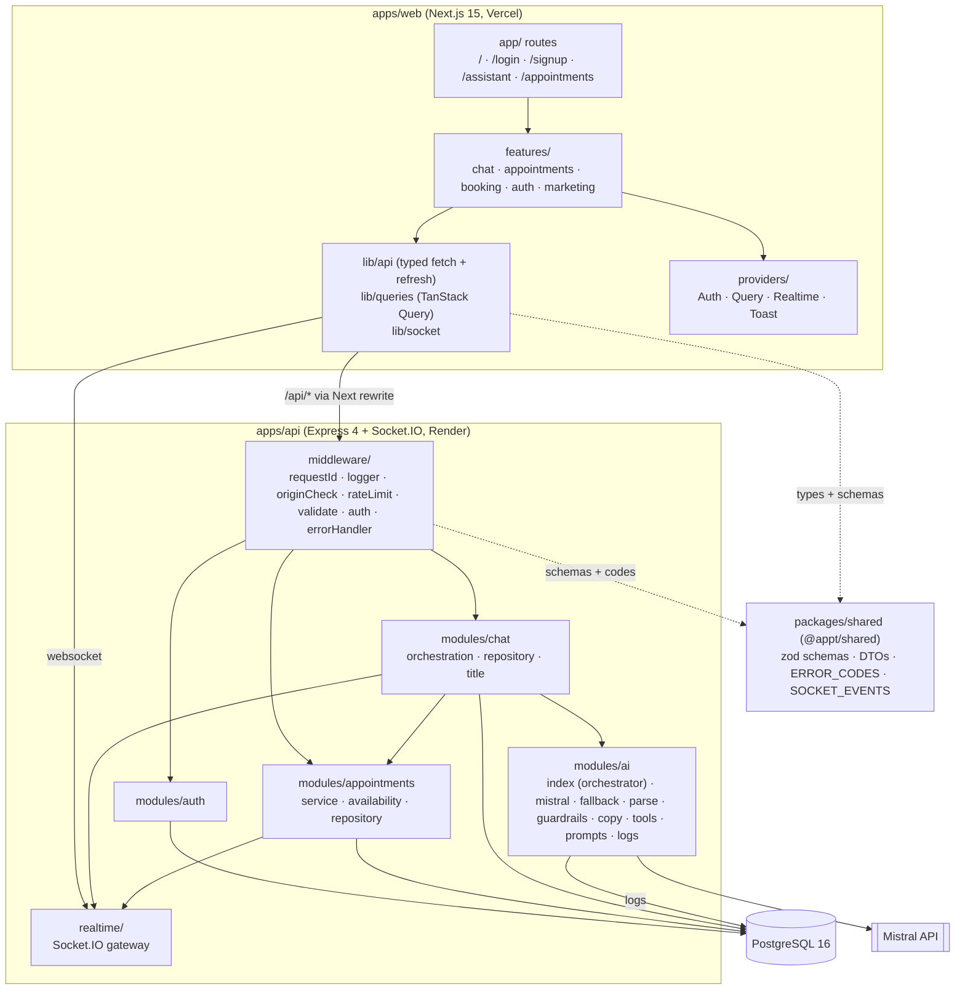

# Architecture

## Components



## Service boundaries

There are three rules, and each one is enforced by the module structure, not by convention.

| Layer | Owns | Must not |
|---|---|---|
| **Routes** (`modules/*/routes.ts`) | HTTP: limiter, `validate()`, status codes, cookies, socket emits after success | Contain business rules |
| **Services** (`modules/*/service.ts`) | Rules and state transitions, transactions | Build responses (they throw `AppError` or return results) |
| **Repositories** (`modules/*/repository.ts`) | SQL. Every query is tenant-scoped by `business_id` taken from the verified JWT | Accept a tenant id from the request body |
| **AI** (`modules/ai`) | Turning a message into `{ slots, reply, intent, engine }` and logging the call | Touch appointments, choose the UI action, or see another tenant |
| **Booking** (`modules/appointments/service.ts`) | The **only** path that creates an appointment, used by the form, the chat and the fallback form | Know which surface called it, apart from `source` |

The chat service in [`modules/chat/service.ts`](../apps/api/src/modules/chat/service.ts) is the seam between them. It merges the AI's slots into the stored draft, resolves the service name against the tenant's catalogue, applies the consent rule, calls the booking service, and decides the `action` the UI renders.

## Request lifecycle and middleware order

Wired in [`app.ts`](../apps/api/src/app.ts). The order is deliberate:

| # | Middleware | Why here |
|---|---|---|
| 1 | `requestId` | Honours a well-formed inbound `X-Request-Id` (it survives the Next proxy hop) or creates one, and echoes it back. Every later log line carries it |
| 2 | `httpLogger` (pino-http) | One access line per request. `/health` is skipped. Request/response serializers are trimmed, and credentials are redacted |
| 3 | `helmet` | Security headers |
| 4 | `cors` | Exact-origin allow-list. `Allow-Credentials` is granted only to a listed origin |
| 5 | `compression` | |
| 6 | `rejectForeignOrigin` | CSRF defence in depth: a POST/PUT/PATCH/DELETE whose `Origin` is not in `CORS_ORIGINS` gets 403 **before the body is read**. No `Origin` (curl, server-to-server) passes |
| 7 | `express.json({ limit: '100kb' })`, `cookieParser` | Oversized bodies become `413 PAYLOAD_TOO_LARGE` |
| 8 | `GET /health`, `/api/health` | Registered before the limiter so platform probes are never throttled |
| 9 | `generalLimiter` on `/api` | 300 req/min per IP |
| 10 | Router: `requireAuth` → tier limiter → `validate(schema)` → `asyncHandler(handler)` | `requireAuth` runs first on chat/appointments routes, so their limiters key by **user id** |
| 11 | `notFoundHandler` → `errorHandler` | The only place an error becomes a response: one envelope, request id, no stack traces in production |

`errorHandler` also maps framework and database errors to client statuses. Body-parser errors become 400 or 413. Impossible dates rejected by Postgres (`22007`/`22008`) become 400. An EXCLUDE violation (`23P01`) becomes `409 SLOT_UNAVAILABLE`. A unique violation becomes 409.

## Authentication flow

```mermaid
sequenceDiagram
  participant B as Browser
  participant N as Next.js (/api rewrite)
  participant A as API
  participant D as Postgres

  B->>N: POST /api/auth/login
  N->>A: forward (Origin preserved)
  A->>D: find user (bcrypt verify, constant-time miss)
  A->>D: store SHA-256(refresh token)
  A-->>B: Set-Cookie appt_access (15 min, path /) + appt_refresh (7 d, path /api/auth); body { user, accessToken }
  Note over B: accessToken kept in memory only, for the socket handshake
  B->>N: GET /api/appointments (cookie)
  A-->>B: 401 UNAUTHENTICATED once the access token expires
  B->>N: POST /api/auth/refresh (single-flight per tab, Web Lock across tabs)
  A->>D: claim the old token (UPDATE ... WHERE revoked_at IS NULL), store its successor in one transaction
  A-->>B: new cookies + accessToken; client replays the original request
```

- **Reuse detection.** If someone presents a refresh token that was already rotated **more than 15 seconds ago**, or one ended by logout, every session of that user is revoked. A token rotated within the last 15 seconds is not treated as theft (`REFRESH_REUSE_GRACE_SECONDS` in [`auth/service.ts`](../apps/api/src/modules/auth/service.ts)). If its successor has been used, a sibling tab won the race: `401 SESSION_SUPERSEDED`, nothing revoked. If its successor was never used, the response carrying it was lost (a timeout during a cold start) and no newer cookie will arrive: the rotation is treated as abandoned, like Auth0's reuse interval, the unused successor is revoked (and marked, so it is superseded if it turns up after all) and a fresh pair is issued. Both rows are locked for the decision.
- **Client side.** The web app serializes refreshes across tabs with the Web Locks API. It retries `SESSION_SUPERSEDED` up to 4 times with jittered backoff. Only a definitive 401 ends the session ([`lib/api/client.ts`](../apps/web/src/lib/api/client.ts)).
- **Password handling.** bcrypt cost 12, hashed *before* the transaction opens so a pooled connection is not held during hashing. The 72-byte bcrypt limit is enforced by the shared `passwordSchema`. Login spends equal time on unknown emails ([`lib/password.ts`](../apps/api/src/lib/password.ts)).

## Realtime design

[`realtime/index.ts`](../apps/api/src/realtime/index.ts) · [`RealtimeProvider.tsx`](../apps/web/src/providers/RealtimeProvider.tsx)

- **Enhancement, not dependency.** Every flow completes over REST. The socket adds live delivery to a user's *other* tabs, plus typing indicators. If it cannot connect, the header pill reads "Live updates unavailable" and nothing else changes.
- **Direct connection.** The browser connects to `NEXT_PUBLIC_SOCKET_URL`, not through the Next rewrite. The handshake carries the in-memory access token (`auth: { token }`) and is rejected before joining any room if the token is invalid. On `UNAUTHENTICATED` the client refreshes once and reconnects.
- **A room per user (`user:<id>`), plus one per business for staff and owners (`business:<id>`).** Events matter across a user's whole session list, and the server never tracks which tab views what. Customers never join a business room, and no code path broadcasts to everyone, so cross-user and cross-tenant leaks are structurally impossible. Appointment events go to the customer's room and the business room, and reach each socket once.
- **Socket lifetime follows the token.** A socket is disconnected when the access token that opened it expires (the client reconnects with a fresh one), and all of a user's sockets are closed on logout everywhere and on refresh-token replay.
- **Events** (all server to client, names shared through `SOCKET_EVENTS`):

| Event | Payload | Emitted when |
|---|---|---|
| `assistant:typing` | `{ sessionId, typing }` | A chat turn starts calling the AI, and again when it ends. Always cleared in a `finally` |
| `assistant:turn` | `AssistantTurnDto` | After a chat or draft turn is stored |
| `appointment:created` | `{ appointment }` | A booking by REST, chat or the fallback form, sent to the customer and the business's staff/owners |
| `appointment:updated` | `{ appointment }` | A cancellation, sent to the appointment's customer and the business's staff/owners |

- **Missed events** are not replayed. On reconnect the client invalidates the appointment and session queries instead. With polling transport allowed as a fallback, restrictive proxies degrade to long-polling.

## Multi-tenancy

- **Model:** a shared schema. `businesses` is the tenant root, and every tenant-scoped row carries `business_id`.
- **Scope comes from the token.** `business_id` is a JWT claim (`bid`), and repositories put it in every `WHERE`. Request bodies never carry it.
- **The database enforces it.** Child tables reference parents through **composite foreign keys** `(business_id, id)`, so an appointment cannot point at a user, service or conversation from another tenant even if application code got it wrong.
- **Per-user scoping is in the query, not a separate check.** Chat sessions are filtered by `business_id AND user_id`. Customers' appointment queries add `user_id`. Another user's resource returns 404, not 403, so ids do not leak existence.
- **Tenant-specific AI context.** The prompt and the tool's `serviceName` enum are built from the tenant's own live catalogue and hours.
- **Not done:** Postgres Row Level Security as a second net, and per-tenant rate limits or quotas.

## Time and timezones

- The business's IANA timezone lives on `businesses.timezone`. Users enter wall-clock `date` + `time` in that zone.
- **Postgres does the conversion** (`($date || ' ' || $time)::timestamp AT TIME ZONE b.timezone`) at insert time and in availability. It ships the tz database, so Node and the DB cannot disagree about DST. `ends_at` is derived from the service duration in the same statement.
- The pg driver's type parsers emit every `timestamptz` as a UTC ISO string (`...Z`). The web formats instants in the business zone (`lib/datetime.ts`).
- The AI receives "today" and "now" in the business zone. chrono-node parses against the business wall clock, not the server's.

## Error contract

There is one envelope for every failure (`ApiErrorBody` in `@appt/shared`):

```json
{ "error": { "code": "SLOT_UNAVAILABLE", "message": "That slot is already booked.", "details": { "field": ["..."] }, "requestId": "..." } }
```

The UI branches on `code`, never on `message`. See [api.md](api.md#errors) for the full list of codes.
