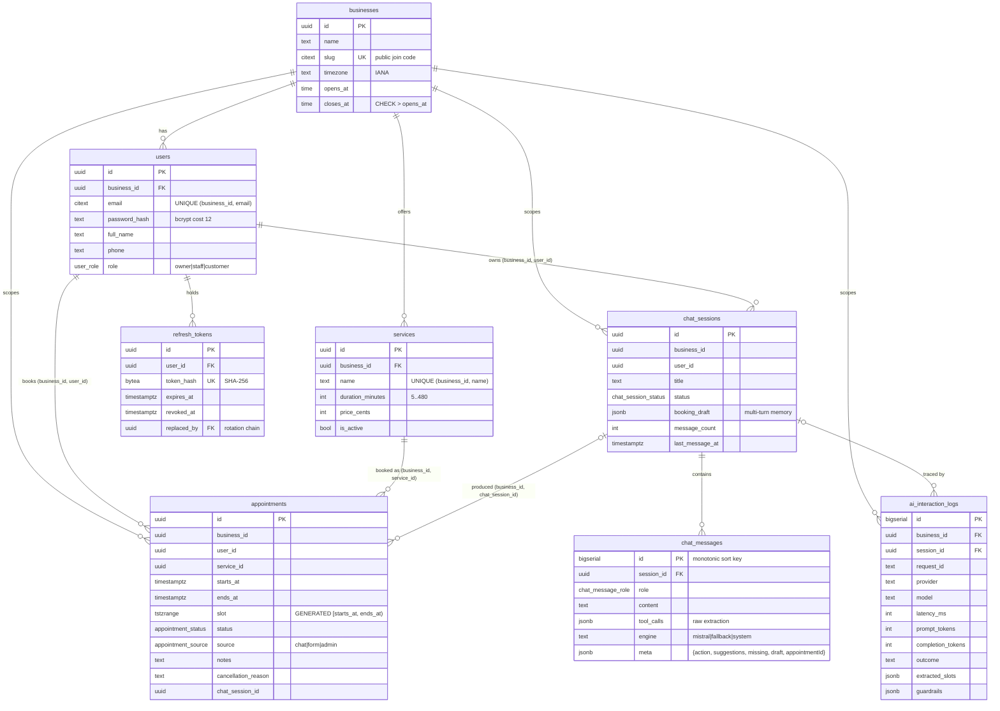

# Database design

PostgreSQL 16 (15+ required by migration 003). The DDL is plain SQL in [`db/migrations`](../db/migrations), sample data is in [`db/seed.sql`](../db/seed.sql), and the schema's guarantees are demonstrated in [`db/verify.sql`](../db/verify.sql). The same checks run in [`schema.test.ts`](../apps/api/test/integration/schema.test.ts) on every test run.

## Entity relationships



## Tables

| Table | Purpose | Key constraints |
|---|---|---|
| `businesses` | Tenant root. Holds the booking policy (timezone, opening hours) the AI and availability read | `slug` citext unique with format CHECK; `closes_at > opens_at` |
| `users` | Authentication and profile | `UNIQUE (business_id, email)`, because email is unique **per tenant** (the same person can use two businesses); `UNIQUE (business_id, id)` as the target for composite FKs; email and phone format CHECKs |
| `refresh_tokens` | Rotating, server-side refresh tokens | Only the SHA-256 is stored (`token_hash` unique); `revoked_at` + `replaced_by` keep the rotation chain so a replay can be told apart from a multi-tab race; `expires_at > created_at` |
| `services` | Bookable catalogue. `duration_minutes` means the AI only has to extract a start time | `UNIQUE (business_id, name)`, `UNIQUE (business_id, id)`, duration 5–480, price ≥ 0 |
| `appointments` | Scheduling data and status | See below |
| `chat_sessions` | One conversation, its status and the **booking draft** carried across turns | Composite FK to users; `booking_draft` must be a JSON object; `UNIQUE (business_id, id)` |
| `chat_messages` | The transcript, including the raw tool-call extraction and the outcome of each turn (`meta`) | `engine IN ('mistral','fallback','system')`, content ≤ 8000, `tool_calls` must be an array and `meta` an object |
| `ai_interaction_logs` | One row per provider call: success, timeout, fallback, or guardrail correction | Non-negative latency/tokens; `guardrails` must be an array |

### `appointments` in detail

```sql
slot tstzrange GENERATED ALWAYS AS (tstzrange(starts_at, ends_at, '[)')) STORED,

CONSTRAINT appointments_user_fk    FOREIGN KEY (business_id, user_id)    REFERENCES users    (business_id, id) ON DELETE CASCADE,
CONSTRAINT appointments_service_fk FOREIGN KEY (business_id, service_id) REFERENCES services (business_id, id) ON DELETE RESTRICT,

CONSTRAINT appointments_no_overlap EXCLUDE USING gist (
  business_id WITH =, service_id WITH =, slot WITH &&
) WHERE (status IN ('pending', 'confirmed'))
```

- **No double booking, enforced by the database.** Two concurrent requests can both pass the application's availability check, but only one can commit. The loser's `23P01` becomes `409 SLOT_UNAVAILABLE`, or a "someone just took that slot" reply with alternatives in chat. `'[)'` means 10:00–10:30 and 10:30–11:00 do not clash. Cancelled and completed rows are outside the predicate, so a freed slot can be rebooked immediately.
- **Scope of the constraint:** it is per **service** ("one chair per service"), a prototype simplification. A real practice would constrain per practitioner or room.
- **One customer, one place at a time.** [005](../db/migrations/005_appointments_customer_no_overlap.sql) adds `appointments_customer_no_overlap`, an `EXCLUDE` on `(business_id, user_id, slot)` with the same live-status predicate, so a customer cannot hold two overlapping bookings even for different services. Its violation becomes `409 CUSTOMER_BUSY`; the error handler tells the two constraints apart by name. Before adding it, the migration cancels the later-created booking of any overlapping pair, with a reason.
- **Status lifecycle.** Rows are inserted `confirmed` (the API sets it explicitly). `confirmed → cancelled` is the only transition today, by the customer or staff. `completed` and `no_show` are reserved for a staff endpoint that does not exist yet, and `pending` for an approval flow, which is why the column defaults to `pending`. The `admin` source is display-only: clients may send only `chat` or `form`.
- **Composite tenant FKs.** A row cannot reference a user, service or (since [003](../db/migrations/003_appointment_chat_session_tenant_fk.sql)) conversation in another tenant. `chat_session_id` uses `ON DELETE SET NULL (chat_session_id)`, so deleting a conversation never deletes the appointment it produced.
- `ends_at > starts_at`; notes ≤ 2000; cancellation reason ≤ 500.
- Native ENUMs for stable value sets (role, status, source, message role, session status). Adding a value is cheap; renaming one needs a migration.

## Indexing strategy

Every index in [002_indexes.sql](../db/migrations/002_indexes.sql) names the query it serves. UNIQUE constraints already create a btree, and Postgres does **not** index foreign keys automatically, so FK indexes are explicit.

| Index | Serves | Used by |
|---|---|---|
| `UNIQUE (business_id, email)` on users | Signup uniqueness per tenant | the constraint itself |
| `users_email_idx (email)` ([006](../db/migrations/006_users_email_idx.sql)) | Login lookup: the sign-in form sends no tenant, so the query filters on email alone, which the composite unique index cannot seek | `auth/repository.findUserForLogin` |
| `UNIQUE (token_hash)` | Refresh rotation lookup | `findRefreshToken` |
| `refresh_tokens_user_idx (user_id)` | Revoke-all on theft, logout everywhere | `revokeAllForUser` |
| `refresh_tokens_expires_idx (expires_at) WHERE revoked_at IS NULL` | Expired-token sweep | *No sweep job exists yet* |
| `services_business_active_idx (business_id, name) WHERE is_active` | Catalogue by tenant, ordered by name | `listServices` (form, prompt, tool enum) |
| `appointments_user_starts_idx (business_id, user_id, starts_at DESC)` | Customer dashboard, filter + ORDER BY with no sort (read backwards for "upcoming") | `appointments/repository.list` |
| `appointments_business_starts_idx (business_id, starts_at)` | Tenant-wide lists for staff/owners | `list` without `user_id` |
| `appointments_upcoming_idx (business_id, starts_at) WHERE status IN ('pending','confirmed')` | Upcoming live bookings; stays proportional to the active book, not history | `list` with `window=upcoming&status=pending,confirmed` |
| GIST index behind `appointments_no_overlap` | Overlap probing `slot && tstzrange(...)` per service | `checkSlot`, `getAvailability`, and the constraint itself |
| GIST index behind `appointments_customer_no_overlap` | Overlap probing per customer | the customer-busy check in `checkSlot` and availability, and the constraint itself |
| `appointments_service_idx`, `appointments_chat_session_idx` (partial, non-null) | FK joins and cascades | service JOIN, session deletes |
| `chat_sessions_user_recent_idx (business_id, user_id, last_message_at DESC NULLS LAST)` | Sidebar, matching the ORDER BY exactly | `chat/repository.listSessions` |
| `chat_messages_session_id_idx (session_id, id)` | Transcript and "last N turns" (reads the index tail) | `listMessages`, `recentTurns`, `recentOutcomes` |
| `ai_logs_session_idx (session_id, created_at) WHERE session_id IS NOT NULL` | Debugging one conversation | manual / SQL |
| `ai_logs_failures_idx (provider, created_at DESC) WHERE outcome <> 'ok'` | Reliability queries over the rare failures | manual / SQL |
| `ai_logs_created_idx (created_at DESC)` | Windowed rollups | `getAiUsageSummary` (`GET /api/ai/summary`), which also filters on `business_id`; at higher volume a `(business_id, created_at)` index would replace it |
| `users_business_created_idx (business_id, created_at DESC)` | Tenant user list | *No endpoint uses it yet; kept for an admin view* |

Migration [004](../db/migrations/004_chat_turn_meta.sql) adds `chat_messages.meta`, `ai_interaction_logs.guardrails` and the `'system'` engine. None of these is filtered on, so it adds no index. That is deliberate: they are read and written as whole values.

`db/verify.sql` check 6 runs `EXPLAIN` on the dashboard query to show it uses `appointments_user_starts_idx` with no Sort node.

## Performance notes

- **Bounded reads everywhere.** Every list has a `LIMIT` (appointments ≤ 100, sessions 30, transcript newest 200, model history `AI_HISTORY_TURNS`), so response size and prompt cost are flat. The indexes are ordered for **keyset pagination** (`(user, starts_at)`, `(session_id, id)`). Adding a cursor is an API change, not a schema change. `chat_messages.id` is a `bigserial` so it doubles as a stable total order without a timestamp tiebreaker.
- **Partial indexes** keep hot indexes small: live appointments only, active services only, failed AI calls only.
- **Availability is one SQL statement** (`generate_series` over the day plus `NOT EXISTS` on the GIST index), not a loop in Node. "Is this free?" and "is this allowed?" use the same index and cannot disagree.
- **`timestamptz` everywhere for instants**, converted from business wall-clock time by Postgres (`AT TIME ZONE`), which owns the IANA tz database. DST is tested in `availability.test.ts`.
- **Counters are maintained on write.** `appendMessage` inserts the message and bumps `message_count`/`last_message_at` in one CTE, so the sidebar never counts rows.
- **Connection pooling.** `pg.Pool` (`PG_POOL_MAX`, default 10). bcrypt runs before a transaction is opened, so slow hashing never holds a pooled connection. Use Neon's **pooled** connection string in production.
- **AI logging is fire-and-forget.** A failed diagnostic insert never fails or slows a booking.

### What changes at scale

| Pressure | Change |
|---|---|
| `ai_interaction_logs` and `chat_messages` grow fastest | Range-partition by month on `created_at`, drop or archive old partitions, roll latency into a summary table |
| Read-heavy dashboards | Read replicas for lists and availability; writes and `checkSlot`/insert stay on the primary |
| Multiple API instances | Redis for rate-limit counters and the Socket.IO adapter (the in-memory store is per process) |
| Many tenants | Row Level Security on `business_id`; per-tenant quotas; large tenants could move to their own schema without changing the composite-key design |
| Connection count | PgBouncer / Neon pooler in transaction mode |
| Refresh token table | Scheduled sweep using the partial `expires_at` index |

## Migrations workflow

A minimal forward-only runner, [`apps/api/src/db/migrate.ts`](../apps/api/src/db/migrate.ts):

- applies `db/migrations/*.sql` in filename order, **each in its own transaction** (Postgres DDL is transactional)
- records each file and its SHA-256 in `schema_migrations`; an applied file is skipped
- **refuses to run if an applied file was edited.** Fix forward with a new numbered file
- the same runner builds every test database from scratch, so every test run also checks "migrate, then seed"

```bash
npm run db:migrate        # dev (tsx)
npm run db:seed           # idempotent
npm run db:reset          # docker: drop volume, migrate, seed
npm run db:migrate:prod -w @appt/api   # compiled: node dist/db/migrate.js (Render startCommand)
```

## Sample data

[`db/seed.sql`](../db/seed.sql) is the "sample insert statements" deliverable. It is plain SQL that can be run with `psql` alone, because password hashes come from `pgcrypto`'s `crypt(..., gen_salt('bf', 12))`, which produces standard bcrypt. It is idempotent: fixed ids use `ON CONFLICT DO NOTHING`, and messages and logs are guarded with `NOT EXISTS`. It contains:

- two tenants (Bluewave Dental, New York; Northside Clinic, London) to demonstrate isolation
- owner, staff and customer users, and a second-tenant owner
- five services
- a completed chat conversation with stored `meta`, and the appointment it produced (`source = 'chat'`, linked by `chat_session_id`)
- a form booking, a completed past visit, and a cancelled booking whose slot stays rebookable
- AI log rows including a timeout followed by a fallback

Seeded appointment times are relative to `now()` and are computed in each **business's own timezone** (a temporary `pg_temp.seed_local_day(n)` helper, which adds nothing to the schema), so they fall inside opening hours whatever the database session's timezone. Because the seed is idempotent, a database seeded by an older version keeps its old rows; reseed a fresh database to pick up the corrected times.

## Verifying the guarantees

```bash
psql "$DATABASE_URL" -f db/verify.sql
```

Every block runs in a rolled-back transaction:

1. An overlapping booking for the same service is **rejected**.
2. A back-to-back booking is **allowed**.
3. Booking a user from another tenant is **rejected** (composite FK).
4. A cancelled appointment does not block its slot.
5. Linking an appointment to another tenant's conversation is **rejected**.
6. The dashboard query plan uses the index with no Sort.
7. The same customer in two places at once (a different service) is **rejected**.
8. Every live appointment sits inside its business's opening hours, in its timezone (expects 0 rows).
